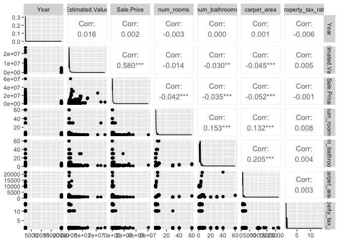
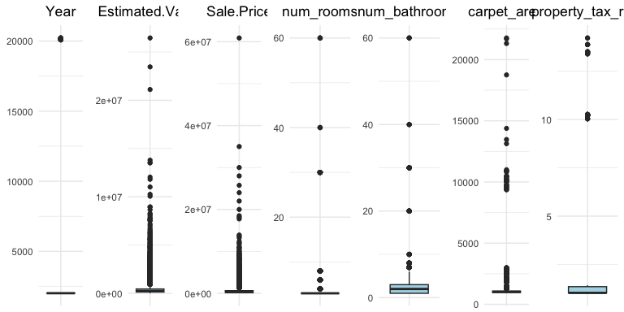
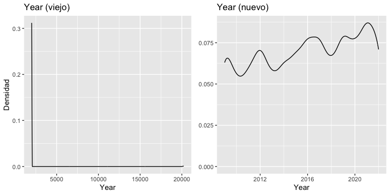
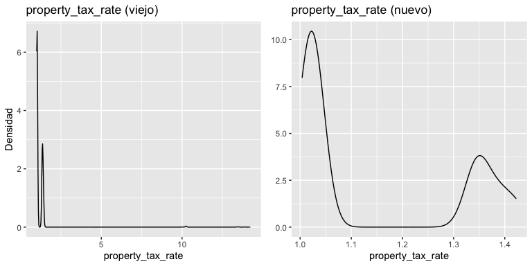
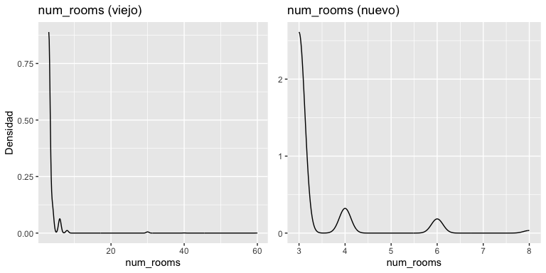
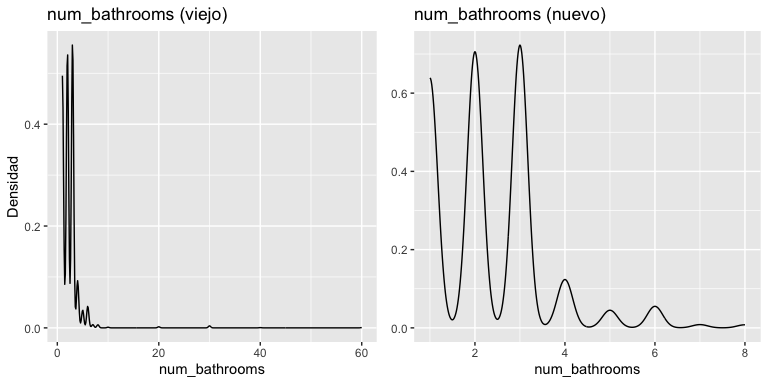
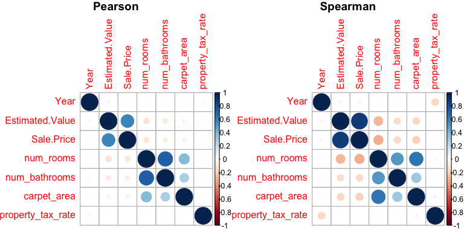
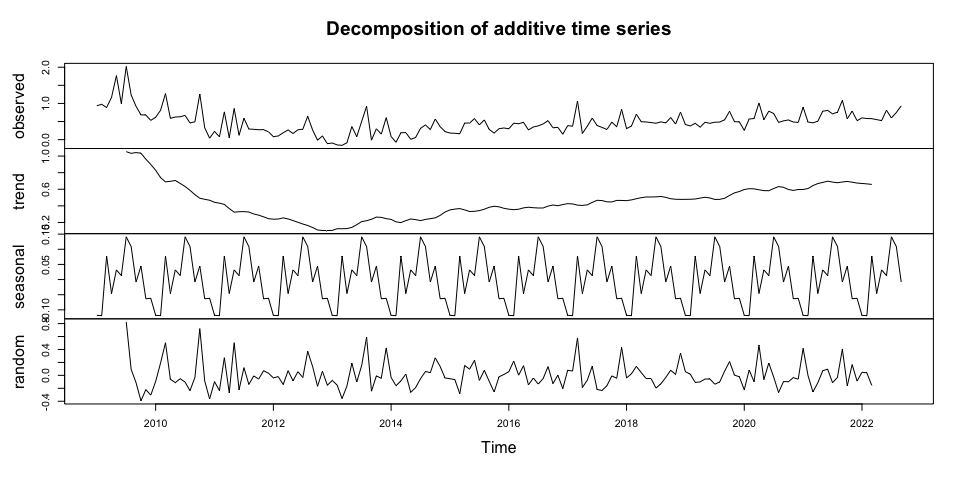
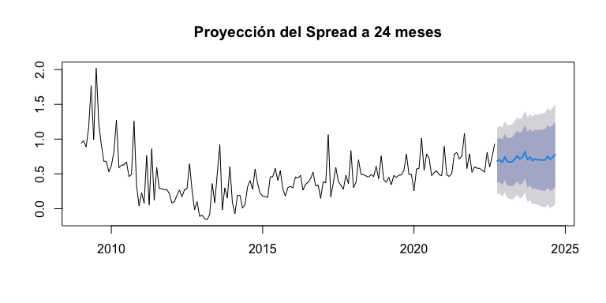
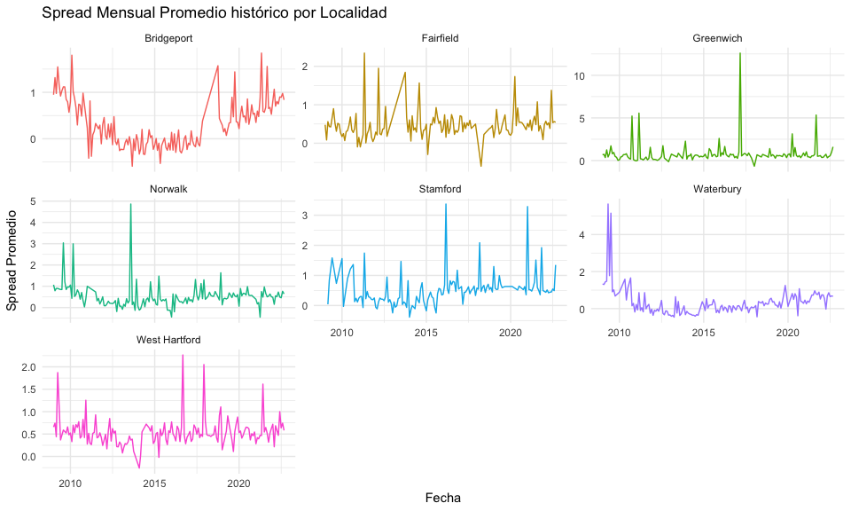

Análisis Exploratorio y de Rentabilidad: Mercado Inmobiliario en
Connecticut
================
Camilo Barbero

## 1. Configuración Inicial y Carga de Datos

Comenzamos cargando las librerías necesarias, nuestras funciones
auxiliares y el conjunto de datos. Como este notebook se encuentra en la
carpeta `/notebooks`, utilizamos rutas relativas para acceder a los
scripts y a los datos.

``` r
# Importación de librerías y funciones desde la carpeta /scripts
source('../scripts/librerias.R')
source('../scripts/funciones.R')

# Carga de los datos desde la carpeta /data
df <- read.csv('../data/Connecticut_realstate_tp.csv')
```

### Diccionario de Datos

- **Date:** Fecha de la transacción.
- **Locality:** Localidad o área de la propiedad.
- **Estimated Value:** Precio estimado de la propiedad.
- **Sale Price:** Precio real de venta de la propiedad.
- **Property:** Tipo de propiedad (ej. Familiar).
- **Residential:** Indica si la propiedad es residencial o no.
- **Num_rooms / Num_bathrooms:** Cantidad de cuartos y baños.
- **Carpet Area:** Superficie alfombrada/cubierta utilizable.
- **Property Tax Rate:** Tasa impositiva aplicable.
- **Face:** Orientación de la propiedad (Norte, Sur, Este u Oeste).

------------------------------------------------------------------------

## 2. Análisis Exploratorio de Datos (EDA) Inicial

Realizamos una primera inspección general de la base de datos para
entender su estructura y detectar anomalías tempranas.

``` r
# Análisis exploratorio general (función auxiliar)
eda_summary <- eda(df)
kable(eda_summary)
```

| Columna | Media | Q1 | Mediana | Q3 | Moda | Min | Max | SD | Coef_Var | Coef_Asim | Coef_Curt | Cant_NA | Uniq | % Uniq | Extremos |
|:---|:---|:---|:---|:---|:---|:---|:---|:---|:---|:---|:---|:---|:---|:---|:---|
| Year | 2130.79 | 2012 | 2016 | 2020 | 2021 | 2009 | 20220 | 1438.97 | 0.68 | 12.44 | 155.79 | 58 | 29 | 0.29 | 63 |
| Estimated.Value | 471541.33 | 131170 | 245000 | 449140 | 237930 | 0 | 26459300 | 901778.32 | 1.91 | 10.45 | 200.58 | 1286 | 7670 | 76.7 | 917 |
| Sale.Price | 662964.51 | 160000 | 340250 | 636500 | 4e+05 | 2000 | 60893650 | 1406330.36 | 2.12 | 15.07 | 451.47 | 56 | 2639 | 26.39 | 1024 |
| num_rooms | 3.51 | 3 | 3 | 3 | 3 | 3 | 60 | 2.54 | 0.72 | 12.09 | 185.03 | 54 | 8 | 0.08 | 1752 |
| num_bathrooms | 2.45 | 1 | 2 | 3 | 3 | 1 | 60 | 2.23 | 0.91 | 11.52 | 213.64 | 66 | 14 | 0.14 | 117 |
| carpet_area | 1164.19 | 960 | 1022 | 1082 | 928 | 900 | 21770 | 851.97 | 0.73 | 13.92 | 250.82 | 3455 | 811 | 8.11 | 982 |
| property_tax_rate | 1.21 | 1.0234955 | 1.03 | 1.348259 | 1.0234955 | 1 | 14.22 | 0.85 | 0.7 | 12 | 154.85 | 65 | 29 | 0.29 | 65 |
| Date | Texto | Texto | Texto | Texto | 2021-07-02 | Texto | Texto | Texto | Texto | Texto | Texto | 52 | 3088 | 30.88 | TEXTO |
| Locality | Texto | Texto | Texto | Texto | Bridgeport | Texto | Texto | Texto | Texto | Texto | Texto | 1297 | 8 | 0.08 | TEXTO |
| Property | Texto | Texto | Texto | Texto | Single Family | Texto | Texto | Texto | Texto | Texto | Texto | 57 | 6 | 0.06 | TEXTO |
| Residential | Texto | Texto | Texto | Texto | Detached House | Texto | Texto | Texto | Texto | Texto | Texto | 58 | 5 | 0.05 | TEXTO |
| Face | Texto | Texto | Texto | Texto | North | Texto | Texto | Texto | Texto | Texto | Texto | 57 | 5 | 0.05 | TEXTO |

``` r
# Subconjunto numérico
idx <- which(sapply(df, class) %in% c("numeric","integer"))
df_num <- subset(df, select = idx)

# Visualización de relaciones iniciales
ggpairs(df_num)
```



> **Observaciones Iniciales:**
>
> - Todas las variables presentan valores faltantes (NAs) que deberemos
>   imputar.
> - Existe una asimetría extrema en todas las variables numéricas.
> - Se detectan anomalías claras: la variable `Year` tiene una media
>   ilógica (ej. 2130) evidenciando errores de tipeo (años de 5
>   dígitos). Las variables como `Property Tax Rate` presentan tasas del
>   100% que no son lógicas para propiedades en el mismo estado,
>   sugiriendo errores en la posición de la coma decimal.

------------------------------------------------------------------------

## 3. Limpieza de Datos: Outliers y Valores Faltantes

### 3.1 Tratamiento de Outliers y Corrección de Errores

Para la detección inicial de valores atípicos utilizamos el método del
Rango Intercuartílico (IQR), visualizando la dispersión mediante
boxplots. Sin embargo, decidimos no aplicar una eliminación a ciegas. Al
analizar los datos extremos, descubrimos que la gran mayoría
correspondía a **errores humanos de tipeo** durante la carga de los
listados:

- **Variables Temporales e Impositivas (`Year`, `property_tax_rate`):**
  Encontramos años de 5 dígitos y tasas impositivas mayores al 100%. Al
  observar la distribución natural de las propiedades, dedujimos que se
  trataba de un cero adicional agregado por error en el año y de un mal
  posicionamiento de la coma decimal en la tasa impositiva.
- **Habitaciones y Baños (`num_rooms`, `num_bathrooms`):** El método IQR
  marcaba más de 1700 propiedades como outliers. Al inspeccionar los
  casos más extremos (por ejemplo, propiedades con 30 cuartos), notamos
  que tenían apenas 1 o 2 baños y un precio de venta irrisoriamente
  bajo. Esto nos confirmó que no eran propiedades extravagantes reales,
  sino casas familiares normales donde el vendedor tipeó un cero de más.
  Establecimos un umbral lógico (\>= 10) para aplicar una corrección
  matemática en lugar de perder esa información.

A continuación, aplicamos las correcciones matemáticas y verificamos
visualmente el cambio en las distribuciones (antes y después) para
confirmar que se haya eliminado la asimetría artificial.

``` r
# Visualización inicial de la asimetría extrema mediante boxplots
boxplots_vnum(df_num)
```



``` r
# 1. Corrección de la variable Year (Error de tipeo por un 0 adicional)
i_outliers_Year <- encontrar_outliers(df$Year)
Year_old <- df$Year
df$Year[i_outliers_Year] <- as.numeric(substring(df$Year[i_outliers_Year], 1, nchar(df$Year[i_outliers_Year]) - 1))
densidad_new_old(df$Year, Year_old, 'Year')
```



``` r
# 2. Corrección de la Tasa Impositiva (Error en coma decimal)
i_outliers_ptr <- encontrar_outliers(df$property_tax_rate)
property_tax_rate_old <- df$property_tax_rate
df$property_tax_rate[i_outliers_ptr] <- df$property_tax_rate[i_outliers_ptr] / 10
densidad_new_old(df$property_tax_rate, property_tax_rate_old, 'property_tax_rate')
```



``` r
# 3. Corrección de Habitaciones y Baños (Errores de tipeo en decenas)
i_outliers_nroom <- which(df$num_rooms >= 10)
num_rooms_old <- df$num_rooms
df$num_rooms[i_outliers_nroom] <- df$num_rooms[i_outliers_nroom] / 10
densidad_new_old(df$num_rooms, num_rooms_old, 'num_rooms')
```



``` r
i_outliers_nbathroom <- which(df$num_bathrooms >= 10)
num_bathrooms_old <- df$num_bathrooms
df$num_bathrooms[i_outliers_nbathroom] <- df$num_bathrooms[i_outliers_nbathroom] / 10
densidad_new_old(df$num_bathrooms, num_bathrooms_old, 'num_bathrooms')
```



``` r
# 4. Limpieza de variables categóricas y valores en cero
df$Property <- ifelse(df$Property == '?', NA, df$Property)
df$Estimated.Value <- ifelse(df$Estimated.Value == 0 & !is.na(df$Estimated.Value), NA, df$Estimated.Value)
```

### 3.2 Análisis y Tratamiento de Valores Faltantes (NAs)

Antes de aplicar cualquier método de imputación, es fundamental entender
el mecanismo de los datos faltantes. Comenzamos evaluando si los datos
están distribuidos completamente al azar mediante el test de Little
(MCAR).

``` r
# H0: Los datos faltantes están distribuidos completamente al azar
mcar_test(df)
```

    ## # A tibble: 1 × 4
    ##   statistic    df p.value missing.patterns
    ##       <dbl> <dbl>   <dbl>            <int>
    ## 1      921.  1051   0.998              112

> **Conclusión del Test:** Obtuvimos un p-valor = 0.998. Estableciendo
> un nivel de significancia de 0.05, no hay evidencia para rechazar la
> hipótesis nula. Esto nos da la tranquilidad de que la imputación no
> introducirá un sesgo estructural grave, ya que los faltantes son MCAR.

Sin embargo, para no depender únicamente de un test global y elegir los
métodos más exactos, analizamos las relaciones lineales entre las
variables para realizar imputaciones focalizadas en lugar de un enfoque
generalizado.

#### Correlación entre Variables Numéricas

``` r
# Subconjunto de variables numéricas
idx <- which(sapply(df, class) %in% c("numeric","integer"))
df_num <- subset(df, select = idx)

# Matrices de correlación
cor_matrix_spearman <- cor(df_num, use = "pairwise.complete.obs", method = c("spearman"))
cor_matrix_pearson <- cor(df_num, use = "pairwise.complete.obs", method = c("pearson"))

par(mfrow=c(1,2))
corrplot(cor_matrix_pearson, main="Pearson", mar=c(0,0,1,0))
corrplot(cor_matrix_spearman, main="Spearman", mar=c(0,0,1,0))
```



> **Estrategia de Imputación Numérica:** Aunque la correlación general
> es baja, observamos fuertes vínculos puntuales:
>
> 1.  Fuerte correlación positiva entre `Sale.Price` y
>     `Estimated.Value`.
> 2.  Alta correlación (\>0.8) entre `num_bathrooms` y `num_rooms`.
>
> Para preservar estas colinealidades multivariantes, imputaremos estos
> pares de variables por separado utilizando Imputación Múltiple (MICE).

``` r
# 1. Imputación Múltiple (MICE): Precios
df_subset1 <- df[, c("Sale.Price", "Estimated.Value")]
data_imputada1 <- mice(df_subset1, m = 5, method = 'pmm', seed = 500, printFlag = FALSE)
df[ , colnames(df_subset1)] <- complete(data_imputada1)

# 2. Imputación Múltiple (MICE): Habitaciones y Baños
df_subset_rooms <- df[, c("num_rooms", "num_bathrooms")]
data_imputada_rooms <- mice(df_subset_rooms, m = 5, method = 'pmm', seed = 500, printFlag = FALSE)
df[ , colnames(df_subset_rooms)] <- complete(data_imputada_rooms)
```

#### Interpolación de Fechas (Series de Tiempo)

Para la variable `Date`, que posee un orden cronológico lineal constante
en los listados, una imputación clásica no es adecuada. Aplicamos
interpolación lineal para mantener la estructura temporal y luego
derivamos el `Year`.

``` r
df$Date <- as.Date(df$Date, format = "%Y-%m-%d")
numeric_dates <- as.numeric(df$Date)
interpolated_dates <- na.approx(numeric_dates, na.rm = FALSE, rule=2)
df$Date <- as.Date(interpolated_dates, origin = "1970-01-01")

df$Year <- format(df$Date, "%Y")
df$Year[is.na(df$Year)] <- format(df$Date[is.na(df$Year)], "%Y")
df$Year <- as.integer(df$Year)
```

#### Asociación de Variables Categóricas (V de Cramer)

Para las variables cualitativas, utilizamos el estadístico V de Cramer
para descubrir asociaciones subyacentes.

``` r
idx_cat <- which(!sapply(df, class) %in% c("numeric", "integer", 'Date'))
df_cat <- subset(df, select = idx_cat)
mati_cor_cat <- matriz_cramers_v(df_cat)
mati_cor_cat
```

    ##               Locality   Property Residential       Face
    ## Locality            NA 0.22733113  0.22814665 0.02641787
    ## Property    0.22733113         NA  1.00000000 0.01309966
    ## Residential 0.22814665 1.00000000          NA 0.01196709
    ## Face        0.02641787 0.01309966  0.01196709         NA

> **Estrategia de Imputación Categórica:** El análisis revela una
> **asociación perfecta** entre `Property` y `Residential` (ej: todo
> “Detached House” es categóricamente un “Single Family”). Aprovechamos
> esto para realizar una imputación condicional determinística entre
> ambas antes de aplicar MICE al resto de las categóricas.

``` r
# 1. Imputación condicional perfecta
df <- df %>% mutate(
  Property = ifelse(is.na(Property),
                    case_when(
                      Residential == "Detached House" ~ "Single Family",
                      Residential == "Duplex" ~ "Two Family",
                      Residential == "Fourplex" ~ "Four Family",
                      Residential == "Triplex" ~ "Three Family",
                      TRUE ~ Property
                    ),Property),
  Residential = ifelse(is.na(Residential),case_when(
    Property == "Four Family" ~ "Fourplex",
    Property == "Single Family" ~ "Detached House",
    Property == "Three Family" ~ "Triplex",
    Property == "Two Family" ~ "Duplex",
    TRUE ~ Residential
  ), Residential)
)

# 2. Imputación múltiple final (MICE) para el resto
df[, idx_cat] <- lapply(df[,idx_cat], as.factor)
df_subset_final <- df[, c("carpet_area", "property_tax_rate","Locality", "Property", "Residential", "Face")]
data_imputada_final <- mice(df_subset_final, m = 5, method = 'pmm', seed = 500, printFlag = FALSE)
df[ , colnames(df_subset_final)] <- complete(data_imputada_final)
```

------------------------------------------------------------------------

## 4. Reducción de Dimensionalidad y Clustering

Se intentaron métodos de aprendizaje no supervisado (K-Means, MCA, PCA)
para encontrar agrupaciones naturales y reducir variables. Sin embargo,
debido a la baja correlación general (el PCA requirió 3 componentes
principales para explicar el 65% de la variabilidad), se determinó que
estas técnicas no arrojaban resultados lo suficientemente contundentes
para resolver el problema de negocio principal. *(El código de esta
sección fue testeado pero omitido en el reporte final para priorizar el
análisis descriptivo y predictivo de rentabilidad).*

------------------------------------------------------------------------

## 5. Análisis de Rentabilidad y Respuestas de Negocio

Definimos nuestra métrica de éxito, el **Spread**, como la relación
entre el Precio de Venta y el Valor Estimado. Un spread positivo indica
rentabilidad, mientras que uno negativo indica depreciación frente al
estimado.

``` r
df$Spread <- (df$Sale.Price/df$Estimated.Value) - 1
```

### 5.1 ¿Qué ciudades son más rentables?

``` r
locality_summary <- df %>%
  group_by(Locality) %>%
  summarise(
    Mean_Spread = mean(Spread, na.rm = TRUE),
    Median_Spread = median(Spread, na.rm = TRUE),
    SD_Spread = sd(Spread, na.rm = TRUE),
    Count = n()
  ) %>%
  arrange(desc(Mean_Spread))

locality_summary
```

    ## # A tibble: 7 × 5
    ##   Locality      Mean_Spread Median_Spread SD_Spread Count
    ##   <fct>               <dbl>         <dbl>     <dbl> <int>
    ## 1 Greenwich           0.759         0.497     2.41   1278
    ## 2 Norwalk             0.603         0.484     1.64   1318
    ## 3 Stamford            0.563         0.449     1.32   1150
    ## 4 West Hartford       0.554         0.519     0.964  1251
    ## 5 Fairfield           0.509         0.400     1.02   1360
    ## 6 Bridgeport          0.389         0.297     1.14   1903
    ## 7 Waterbury           0.353         0.177     2.19   1740

> **Insight:** **Greenwich** lidera en rentabilidad media, pero presenta
> la volatilidad (SD) más alta, lo que implica un riesgo. En contraste,
> **West Hartford** ofrece una inversión más segura y consistente, con
> la mediana más alta y un desvío menor. Las localidades con más
> listados (mayor oferta) tienden a tener spreads más ajustados.

### 5.2 ¿Es mejor una casa “mala” en un barrio “bueno” o viceversa?

Definimos una casa “buena” como aquella que tiene al menos 1 baño por
habitación.

``` r
df$Calidad_Propiedad <- ifelse(df$num_bathrooms/df$num_rooms >= 1, "Buena", "Mala")

summary_by_quality_locality <- df %>%
  group_by(Locality, Calidad_Propiedad) %>%
  summarise(
    Mean_Spread = mean(Spread, na.rm = TRUE),
    Count = n()
  ) %>%
  arrange(Calidad_Propiedad, desc(Mean_Spread))

summary_by_quality_locality
```

    ## # A tibble: 14 × 4
    ## # Groups:   Locality [7]
    ##    Locality      Calidad_Propiedad Mean_Spread Count
    ##    <fct>         <chr>                   <dbl> <int>
    ##  1 Greenwich     Buena                   0.788   429
    ##  2 Norwalk       Buena                   0.646   424
    ##  3 West Hartford Buena                   0.572   450
    ##  4 Stamford      Buena                   0.525   390
    ##  5 Fairfield     Buena                   0.480   481
    ##  6 Waterbury     Buena                   0.389   604
    ##  7 Bridgeport    Buena                   0.366   615
    ##  8 Greenwich     Mala                    0.744   849
    ##  9 Norwalk       Mala                    0.583   894
    ## 10 Stamford      Mala                    0.582   760
    ## 11 West Hartford Mala                    0.544   801
    ## 12 Fairfield     Mala                    0.524   879
    ## 13 Bridgeport    Mala                    0.400  1288
    ## 14 Waterbury     Mala                    0.334  1136

Para validar esto estadísticamente, creamos un modelo de regresión
lineal optimizado con validación cruzada:

``` r
library(caret)
set.seed(123)
control <- trainControl(method = "cv", number = 10) 
model <- train(Spread ~ Locality + num_rooms + num_bathrooms + carpet_area, 
               data = df, method = "lm", trControl = control)

importancia <- varImp(model)$importance
print(importancia)
```

    ##                            Overall
    ## LocalityFairfield        23.780702
    ## LocalityGreenwich       100.000000
    ## LocalityNorwalk          55.436384
    ## LocalityStamford         40.397278
    ## LocalityWaterbury         4.812641
    ## `LocalityWest Hartford`  37.475897
    ## num_rooms                12.774857
    ## num_bathrooms             0.000000
    ## carpet_area               7.108475

> **Insight:** El modelo confirma que la **localidad tiene un 100% de
> importancia relativa** sobre la rentabilidad. Una casa
> estructuralmente “mala” en Greenwich rinde más económicamente que una
> casa “buena” en Bridgeport.

------------------------------------------------------------------------

## 6. Análisis de Series de Tiempo y Estacionalidad

Analizamos el comportamiento histórico del spread para entender cómo
eventos macroeconómicos, como la crisis inmobiliaria de 2008, afectaron
la rentabilidad, y si es posible predecir tendencias futuras.

``` r
library(tseries)
library(forecast)

df$Date <- as.Date(df$Date, format="%Y-%m-%d")
df$YearMonth <- format(df$Date, "%Y-%m")

# Calcular el spread mensual promedio
spread_mensual <- aggregate(Spread ~ YearMonth, df, mean)
spread_mensual$YearMonth <- as.Date(paste0(spread_mensual$YearMonth, "-01"))

# Serie de tiempo general
spread_ts <- ts(spread_mensual$Spread, start=c(2009, 1), frequency=12)
spread_decompuesta <- decompose(spread_ts)

# Plot de los componentes descompuestos
plot(spread_decompuesta)
```



> **Impacto Macroeconómico:** Observamos una clara inflación de precios
> durante la incertidumbre de la crisis de 2008. Luego, la recesión
> empuja el spread a la baja encontrando su piso en 2013. A partir de
> allí, el mercado inmobiliario se recupera con una tendencia alcista
> constante.

### 6.1 Estacionariedad y Proyección (ARIMA)

Al realizar el Test Aumentado de Dickey-Fuller (ADF) sobre la serie
general, obtuvimos un p-valor de ~0.025. Aunque con un nivel de
significancia tradicional del 5% diríamos que la serie es estacionaria,
**el contexto socioeconómico nos indica lo contrario**. Sabiendo
empíricamente que la crisis de 2008 y la posterior recuperación
generaron tendencias reales en los precios, ajustamos nuestro umbral
(alfa = 1%). Con este criterio riguroso, no descartamos la presencia de
una raíz unitaria (no estacionariedad), lo cual justifica el uso de un
modelo ARIMA para proyectar el crecimiento futuro.

``` r
# Test ADF
adf_test <- adf.test(spread_ts)
adf_test
```

    ## 
    ##  Augmented Dickey-Fuller Test
    ## 
    ## data:  spread_ts
    ## Dickey-Fuller = -3.7074, Lag order = 5, p-value = 0.02551
    ## alternative hypothesis: stationary

``` r
# Modelo ARIMA y Forecast
spread_arima <- auto.arima(spread_ts)
spread_forecast <- forecast(spread_arima, h=24)
plot(spread_forecast, main="Proyección del Spread a 24 meses")
```



### 6.2 Tendencias Regionales y Gentrificación

Desglosamos el análisis temporal para entender si todas las localidades
se comportaron igual frente a la crisis y la recuperación.

``` r
# Calcular el spread mensual promedio por localidad
spread_mensual_locality <- df %>%
  group_by(YearMonth, Locality) %>%
  summarize(Spread = mean(Spread), .groups = 'drop')

spread_mensual_locality$YearMonth <- as.Date(paste0(spread_mensual_locality$YearMonth, "-01"))

# Plot facetado por localidad
ggplot(spread_mensual_locality, aes(x=YearMonth, y=Spread, color=Locality)) +
  geom_line() +
  facet_wrap(~ Locality, scales = "free_y") +
  labs(title="Spread Mensual Promedio histórico por Localidad", x="Fecha", y="Spread Promedio") +
  theme_minimal() +
  theme(legend.position="none")
```



> **Insight Regional:** Al iterar el test de Dickey-Fuller para cada
> ciudad, descubrimos que **Bridgeport fue la única localidad con una
> serie no estacionaria** persistente desde 2009 hasta 2022. Mientras
> que otras zonas de inversión tradicional mantuvieron precios más
> consistentes, la marcada tendencia alcista de Bridgeport sugiere un
> proceso de **gentrificación** y atracción de nuevas inversiones, el
> cual se vio pausado temporalmente por la crisis pero retomó fuerza
> post-2013.

### 6.3 Análisis Estacional: ¿Cuándo comprar y cuándo vender?

Aislando el componente estacional de nuestra serie de tiempo general,
buscamos los picos y valles anuales para optimizar los tiempos de
transacción.

``` r
componente_estacional <- spread_decompuesta$seasonal
meses <- month.abb

mejor_mes_compra <- meses[which.min(componente_estacional)]
mejor_mes_venta <- meses[which.max(componente_estacional)]

cat("El mejor mes para COMPRAR es:", mejor_mes_compra, "\n")
```

    ## El mejor mes para COMPRAR es: Feb

``` r
cat("El mejor mes para VENDER es:", mejor_mes_venta, "\n")
```

    ## El mejor mes para VENDER es: Jul

> **Insight Estacional:** Febrero presenta el spread más bajo
> (históricamente negativo, indicando que el precio real cae por debajo
> del valor estimado, ej. ~-11.92%), por lo que es ideal para
> **comprar**. Por el contrario, Julio marca el clímax del mercado, con
> ventas que superan el valor estimado hasta en un ~14.11%, siendo el
> momento óptimo para **vender**.
